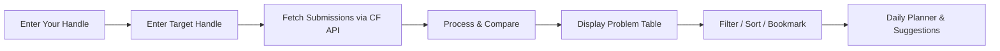

<div align="center">

# ⚡ CF Tracker — Follow & Solve

### A premium Codeforces problem-tracking dashboard to race against any user's submissions

[](https://codeforces.com)
[](https://developer.mozilla.org/en-US/docs/Web/JavaScript/Guide/Modules)
[](https://developer.mozilla.org/en-US/docs/Web/HTML)
[](https://developer.mozilla.org/en-US/docs/Web/CSS)
[](LICENSE)

**Track your competitive programming progress by comparing your solved problems against any Codeforces user.**  
No backend required — runs entirely in your browser.

---

</div>

## 🎯 What is CF Tracker?

CF Tracker is a **client-side web application** that fetches submission data from the [Codeforces API](https://codeforces.com/apiHelp) and lets you:

- Pick any Codeforces user as a **target** (e.g., a friend, mentor, or top-rated coder)
- See every problem they've attempted/solved
- Track which of those problems **you** have solved, attempted, or haven't tried yet
- Plan your daily practice with a smart **daily target planner**

It's like a personal coach that says: *"Here are the problems this user solved — now go solve them too."*

---

## ✨ Features

| Feature | Description |
|---------|-------------|
| 🔄 **Multi-Profile Tracking** | Follow multiple CF users simultaneously, switch between tabs |
| 📊 **Live Stats Dashboard** | Total / Solved / Attempted / Remaining counts with a progress bar |
| 📋 **Sortable Problem Table** | Sort by date, rating, status, or bookmarks — with pagination |
| 🔍 **Advanced Filtering** | Filter by your status, target status, rating range, tags, and free-text search |
| ⭐ **Bookmarks** | Star problems you want to revisit later |
| ☑️ **Checkmarks** | Archive completed problems to keep your list clean |
| 📄 **Submission Details** | Expand any row to compare both users' submission history side-by-side |
| 🎯 **Daily Target Planner** | Set a deadline or daily count — get a smart breakdown by rating bucket |
| 💡 **Problem Suggestions** | Daily rotating suggestions based on your CF rating |
| 🔐 **Session Management** | "Remember Me" for 1 month or session-only login |
| 💾 **Fully Offline** | All data cached in localStorage — works without re-fetching |
| 📱 **Responsive Design** | Optimized breakpoints for desktop, tablet, and mobile |

---

## 🚀 Getting Started

### Prerequisites

- A modern web browser (Chrome, Firefox, Edge, Safari)
- A local HTTP server (required for ES modules)

### Installation & Setup

1. **Clone the repository**
   ```bash
   git clone https://github.com/justiceraj02/CF-TRACKER.git
   cd CF-TRACKER
   ```

2. **Navigate to the app directory**
   ```bash
   cd cf-tracker-main
   ```

3. **Start a local server** (pick any one):
   ```bash
   # Option 1: npx (no install needed)
   npx serve .

   # Option 2: Python 3
   python -m http.server 8080

   # Option 3: VS Code Live Server
   # Right-click index.html → "Open with Live Server"

   # Option 4: Node.js http-server
   npx http-server . -p 8080
   ```

4. **Open in browser** — Navigate to `http://localhost:8080` (or whichever port your server uses)

5. **First-time setup** — Enter your CF handle and the target handle you want to track, then click **🚀 Start Tracking**

---

## 📁 Project Structure

```
CF-TRACKER/
├── README.md                   ← You are here
└── cf-tracker-main/
    ├── index.html              ← Single-page HTML layout
    ├── README.md               ← Detailed inner README
    ├── LICENSE                  ← MIT License
    ├── .gitignore              ← Git ignore rules
    ├── .editorconfig           ← Editor configuration
    ├── css/
    │   └── styles.css          ← All styles (glassmorphism, dark theme, animations)
    └── js/
        ├── app.js              ← Entry point — rendering, UI events, state management
        ├── config.js           ← Constants, localStorage keys, session logic
        ├── utils.js            ← Pure utility functions (escapeHtml, formatting, etc.)
        ├── storage.js          ← localStorage CRUD (profiles, bookmarks, checkmarks)
        ├── api.js              ← Codeforces API communication (paginated fetching)
        └── data.js             ← Data processing, filtering, sorting, planner logic
```

---

## 🛠️ Tech Stack

| Layer | Technology |
|-------|-----------|
| **Markup** | HTML5 — Semantic elements |
| **Styling** | CSS3 — Custom Properties, Grid, Flexbox, glassmorphism, micro-animations |
| **Logic** | Vanilla JavaScript — ES Modules, Fetch API |
| **Storage** | Browser localStorage + sessionStorage |
| **Fonts** | Google Fonts — [Inter](https://fonts.google.com/specimen/Inter) & [JetBrains Mono](https://fonts.google.com/specimen/JetBrains+Mono) |
| **Data Source** | [Codeforces API](https://codeforces.com/apiHelp) — real-time submission data |
| **Backend** | None — 100% client-side |

---

## 🎨 Design Highlights

- 🌑 **Dark Mode** — Sleek dark theme with subtle gradient backgrounds
- 🏷️ **CF Rating Badges** — Color-coded badges matching Codeforces rating colors:
  - `Gray` → `Green` → `Cyan` → `Blue` → `Violet` → `Orange` → `Red`
- ✨ **Micro-Animations** — Smooth hover effects, row entry animations, and panel transitions
- 🪟 **Glassmorphism** — Frosted-glass UI cards for a modern premium feel
- 📱 **Responsive** — Breakpoints at `900px` and `600px` for all screen sizes

---

## 🧩 How It Works



1. **Authentication-Free** — Just enter Codeforces usernames, no API keys needed
2. **Paginated API Calls** — Fetches submissions in batches of 10,000 to handle large submission histories
3. **Smart Caching** — All data is stored in `localStorage` so subsequent visits load instantly
4. **Per-Profile Storage** — Each target user's data is stored independently

---

## 🔧 Configuration

The app uses `localStorage` for all persistence. Key configuration constants are in [`config.js`](cf-tracker-main/js/config.js):

| Constant | Default | Description |
|----------|---------|-------------|
| `PAGE_SIZE_TABLE` | `50` | Number of problems per page |
| `CF_API_BASE` | `https://codeforces.com/api` | Codeforces API endpoint |
| Remember Me duration | 30 days | Session expiry when "Remember Me" is checked |

---

## 🤝 Contributing

Contributions are welcome! Here's how:

1. **Fork** the repository
2. **Create** a feature branch (`git checkout -b feature/amazing-feature`)
3. **Commit** your changes (`git commit -m 'Add amazing feature'`)
4. **Push** to the branch (`git push origin feature/amazing-feature`)
5. **Open** a Pull Request

### Ideas for Contribution

- [ ] Add contest-wise grouping of problems
- [ ] Export progress to CSV/PDF
- [ ] Add a heatmap visualization (GitHub-style)
- [ ] Support for virtual contest recommendations
- [ ] Add dark/light theme toggle

---

## 📄 License

This project is licensed under the **MIT License** — see the [LICENSE](cf-tracker-main/LICENSE) file for details.

---

## 🙏 Acknowledgments

- [Codeforces](https://codeforces.com) — for the open API that makes this possible
- [Google Fonts](https://fonts.google.com) — for Inter and JetBrains Mono typefaces

---

<div align="center">

**Built with ❤️ for the competitive programming community**

⭐ Star this repo if you find it useful!

</div>
